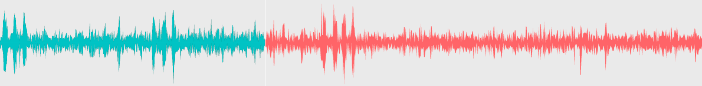
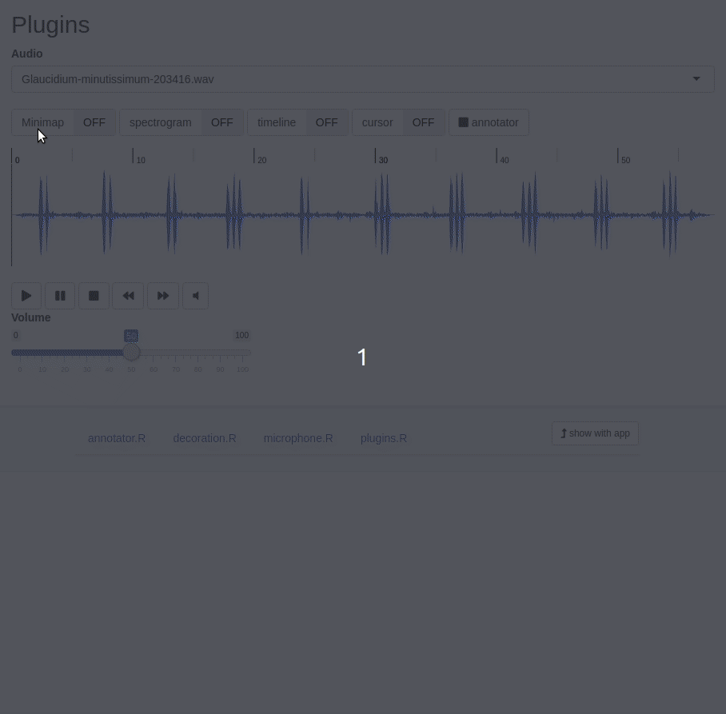
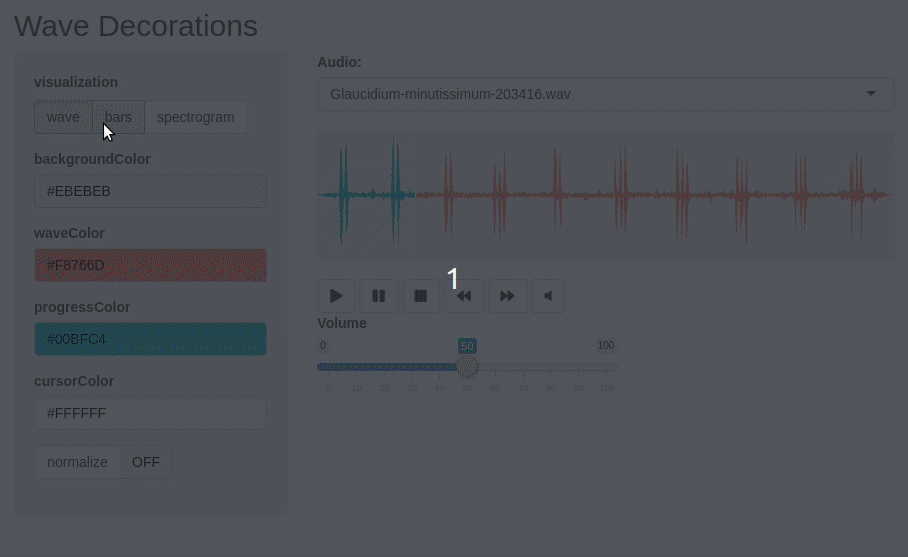

<!-- README.md is generated from README.Rmd. Please edit that file -->

```{r, include = FALSE}
knitr::opts_chunk$set(
  collapse = TRUE,
  comment = "#>",
  fig.path = "man/figures/README-",
  out.width = "100%"
)
```

# wavesurfer

<!-- badges: start -->
[](https://CRAN.R-project.org/package=wavesurfer)
[](https://www.tidyverse.org/lifecycle/#experimental)
<!-- badges: end -->



An interactive soundwave player and visualizer with rich set of plugins. It works well with pipe (%>%) and can be used in Shiny. It is an interface of ['wavesurfer.js'](https://wavesurfer-js.org) JavaScript library and it is based on ['htmlwidgets'](http://www.htmlwidgets.org/) R package.

## Installation

``` r
# install.packages("remotes")
remotes::install_github("Athospd/wavesurfer")
```
## Using in Shiny

Usage at shiny app:

```{r, eval=FALSE}
library(wavesurfer)
library(shiny)

ui <- fluidPage(
  wavesurferOutput("my_ws"),
  tags$p("Press spacebar to toggle play/pause."),
  actionButton("mute", "Mute", icon = icon("volume-off"))
)

server <- function(input, output, session) {
  output$my_ws <- renderWavesurfer({
    wavesurfer(audio = "http://ia902606.us.archive.org/35/items/shortpoetry_047_librivox/song_cjrg_teasdale_64kb.mp3") %>%
      ws_set_wave_color('#5511aa') %>%
      ws_spectrogram() %>%
      ws_cursor()
  })
  
  observeEvent(input$mute, {
    ws_toggle_mute("my_ws")
  })
}

shinyApp(ui = ui, server = server)
```


## annotator_app()

The goal of `annotator_app()` is to provide an quick way to one start annotating their audio. It requires two inputs:

- `wavs_folder` a string with the path to the wave files folder.
- `annotations_folder` a string with where to store the annotations (as a `.rds` containg a `tibble`)

```{r, eval=FALSE}
# This is a working code!
annotator_app(
  wavs_folder = system.file("wav", package = "wavesurfer"), 
  annotations_folder = tempdir()
)
```


## Live examples

### Annotator

live app: [athos.shinyapps.io/wavesurfer_annotator/](https://athos.shinyapps.io/wavesurfer_annotator/) 

```{r annotator, eval=FALSE}
wavesurfer::runExample("annotator")
```


### Plugins

live app: [athos.shinyapps.io/wavesurfer_plugins/](https://athos.shinyapps.io/wavesurfer_plugins/) 

```{r plugins, eval=FALSE}
wavesurfer::runExample("plugins")
```



### Wave Decorations

live app: [athos.shinyapps.io/wavesurfer_decoration/](https://athos.shinyapps.io/wavesurfer_decoration/) 

```{r decoration, eval=FALSE}
wavesurfer::runExample("decoration")
```




## Acknowledgement

The main actors that made this package possible were:

- [htmlwidgets](http://www.htmlwidgets.org/) package; 
- [This tutorial](https://deanattali.com/blog/htmlwidgets-tips/) by [Dean Attali](https://deanattali.com/) and his [timevis](https://github.com/daattali/timevis) package from which I copy pasted massively.
- [wavesurfer.js](https://wavesurfer-js.org/) library by [katspaugh](https://github.com/katspaugh).
- [This annotator](https://github.com/CrowdCurio/audio-annotator) that inspired me for make the spectrogram visualization for wavesurfer.js 3.0.0. A lot of ctr+C/ctr+V too.
- [wikiaves.com.br](https://wikiaves.com.br) from where I took audio examples for the showcases.

Thank you very much for your work.
